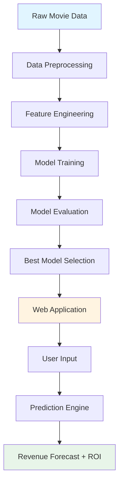
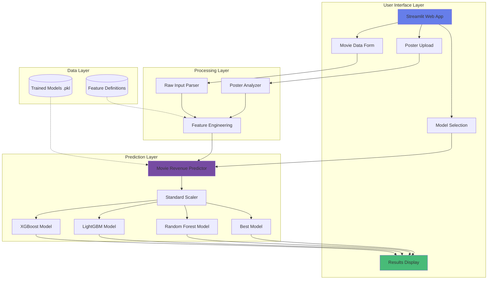
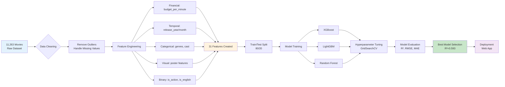

# 🎬 Movie Revenue Predictor

<div align="center">


**An end-to-end machine learning system that predicts movie box office revenue with 59% R² accuracy**

[Quick Start](#-quick-start) • [Live Demo](#-using-the-web-app) • [Architecture](#️-system-architecture)

</div>

---

## 📖 Table of Contents

- [Overview](#-overview)
- [What This App Does](#-what-this-app-does)
- [Quick Start](#-quick-start)
- [System Architecture](#️-system-architecture)
- [Project Structure](#-project-structure)
- [Dataset & Features](#-dataset--features)
- [Model Performance](#-model-performance)
- [Using the Web App](#-using-the-web-app)
- [Tech Stacks](#-core-stack)
- [License](#-license)

---

## 🎯 Overview

The **Movie Revenue Predictor** is a comprehensive machine learning project that predicts box office revenue for movies based on production features, cast details, genres, release timing, and visual poster characteristics. This system includes a complete ML pipeline from data exploration to a production-ready web application.

### Key Highlights

- 🎯 **59.3% R² Score** - Explains ~59% of revenue variance with moderate overfitting control
- 📊 **11,263 Movies** - Trained on extensive dataset from 2000-2024
- 🤖 **4 ML Models** - XGBoost, LightGBM, Random Forest, Best Model (ensemble)
- 🖼️ **Poster Analysis** - Automatic visual feature extraction from movie posters
- 📈 **Real-time Predictions** - Instant revenue forecasts with ROI calculations

---

## 💡 What This App Does

### For Movie Studios & Producers
- **Revenue Forecasting**: Predict expected box office performance before production
- **Budget Planning**: Optimize production budgets based on predicted returns
- **Release Strategy**: Identify optimal release timing (summer vs. holiday)
- **ROI Analysis**: Calculate expected return on investment
- **Risk Assessment**: Compare scenarios with different budget/cast/genre combinations

### For Data Scientists & Developers
- **Complete ML Pipeline**: End-to-end workflow from EDA to deployment
- **Feature Engineering**: 31+ engineered features from raw movie data
- **Model Comparison**: Multiple algorithms with hyperparameter tuning
- **Production Deployment**: Beautiful Streamlit web interface
- **Educational Resource**: Well-documented notebooks and code

### How It Works

1. **Input Movie Data**: Enter natural movie information (title, budget, cast, genres, etc.)
2. **Upload Poster** (Optional): Automatic extraction of brightness, saturation, dominant colors
3. **Feature Engineering**: App automatically creates 31+ ML features
4. **Prediction**: Choose from 4 trained models or compare all
5. **Results**: View predicted revenue, ROI, profit/loss, and visual analytics

---

## 🚀 Quick Start

### ⚡ Fastest Method (Recommended)

**Windows (PowerShell):**
```powershell
.\run_app.ps1
```

**Windows (Command Prompt):**
```batch
run_app.bat
```

The launcher will:
- Check for virtual environment
- Verify all dependencies
- Start the Streamlit server
- Open browser to http://localhost:8501

### 📦 Manual Installation

**Step 1: Clone Repository**
```bash
git clone <repository-url>
cd movie-revenue-predictor
```

**Step 2: Create Virtual Environment**
```bash
python -m venv .venv

# Windows
.\.venv\Scripts\activate

# macOS/Linux
source .venv/bin/activate
```

**Step 3: Install Dependencies**
```bash
# Dependencies
pip install -r requirements.txt
```

**Step 4: Run Application**
```bash
streamlit run app/app.py
```

The app will launch at: **http://localhost:8501**

---

## 🏗️ System Architecture

### High-Level Workflow



### Detailed Application Architecture



### Data Flow Pipeline



---

## 📂 Project Structure

```
movie-revenue-predictor/
│
├── app/                                  # Web Application
│   ├── app.py                            # Main Streamlit UI
│   ├── prediction_utils.py               # ML predictor + feature engineering
│   ├── poster_analyzer.py                # Image feature extraction
│   └── prediction_utils                  # Prediction logic
│
├── notebooks/                            # Jupyter Notebooks (End-to-End Pipeline)
│   ├── 01_data_exploration.ipynb         # EDA and data understanding
│   ├── 02_data_preprocessing.ipynb       # Data cleaning and validation
│   ├── 03_feature_engineering.ipynb      # Feature creation and transformation
│   ├── 04_model_training.ipynb           # Model training and tuning
│   ├── 05_model_evaluation.ipynb         # Performance analysis
│   └── 06_meaningful_insights.ipynb      # Business insights
│
├── models/                               # Trained ML Models
│   ├── best_model.pkl                    # Best performing model
│   ├── xgboost_tuned.pkl                 # XGBoost with hyperparameters
│   ├── lightgbm_tuned.pkl                # LightGBM with hyperparameters
│   ├── random_forest_tuned.pkl           # Random Forest with hyperparameters
│   ├── scaler.pkl                        # StandardScaler (fitted)
│   ├── evaluation_summary.csv            # Model metrics summary
│   └── model_evaluation_results.csv      # Detailed evaluation results
│
├── data/                                 # Datasets
│   ├── raw/
│   │   └── movies_dataset_revenue.csv    # Original dataset
│   └── processed/
│       ├── movies_preprocessed.csv       # Cleaned data
│       └── movies_featured.csv           # Engineered features
│
├── src/                                  # Source Code Reusable Modules
│   ├── __init__.py
│   ├── data/
│   │   ├── __init__.py
│   │   ├── crawler.py                    # Data collection utilities               
│   │   └── preprocessor.py               # Data preprocessing
│   ├── features/
│   │   ├── __init__.py
│   │   └── feature_engineering.py        # Feature creation functions
│   └── models/
│       ├── evaluator.py                  # Evaluate models
│       ├── trainer.py                    # Train models
│       └── __init__.py
│
├──requirements.txt   
├──LICENSE                               
└── README.md                            
```

### Key Directories Explained

| Directory | Purpose | Key Files |
|-----------|---------|-----------|
| **app/** | Production web application | `app.py`, `prediction_utils.py`, `poster_analyzer.py` |
| **notebooks/** | ML pipeline development | 6 notebooks from EDA to insights |
| **models/** | Serialized trained models | 4 models + scaler + evaluation CSVs |
| **data/** | Raw and processed datasets | Original 11K movies + engineered features |
| **src/** | Reusable source code | Feature engineering, data processing |
| **tests/** | Verification scripts | Prediction tests, app verification |

---

## 📊 Dataset & Features

### Dataset Overview

| Attribute | Details |
|-----------|---------|
| **Total Movies** | 11,263 |
| **Time Period** | 2000 - 2024 |
| **Features Engineered** | 31 |
| **Target Variable** | `revenue` (box office revenue in USD) |
| **Train/Test Split** | 80% / 20% (9,010 train / 2,253 test) |

### Feature Categories

#### **1. Financial Features**
| Feature | Description | Type | Example |
|---------|-------------|------|---------|
| `budget` | Production budget (log-transformed) | Continuous | log(150,000,000) |
| `budget_per_minute` | Budget efficiency | Calculated | budget / runtime |
| `revenue` | Box office revenue (target) | Continuous | 643,000,000 |

#### **2. Technical Features**
| Feature | Description | Type | Example |
|---------|-------------|------|---------|
| `runtime` | Movie length in minutes | Continuous | 100 |
| `rating` | Expected IMDb rating | Continuous | 7.5 |

#### **3. Visual Features - From Poster**
| Feature | Description | Type | Range | Extraction |
|---------|-------------|------|-------|------------|
| `poster_brightness` | Average pixel intensity | Continuous | 0-255 | PIL Image Analysis |
| `poster_saturation` | Color vibrancy | Continuous | 0-255 | HSV Conversion |
| `poster_dom_r` | Dominant red channel | Continuous | 0-255 | Median RGB |
| `poster_dom_g` | Dominant green channel | Continuous | 0-255 | Median RGB |
| `poster_dom_b` | Dominant blue channel | Continuous | 0-255 | Median RGB |

#### **4. Extracted Features**
| Feature | Description | Type | Source |
|---------|-------------|------|--------|
| `num_genres` | Count of genres | Discrete | Comma-separated list |
| `num_cast` | Count of cast members | Discrete | Comma-separated list |
| `num_directors` | Count of directors | Discrete | Comma-separated list |
| `is_action` | Action genre flag | Binary | Genre detection |
| `is_animation` | Animation genre flag | Binary | Genre detection |
| `is_comedy` | Comedy genre flag | Binary | Genre detection |
| `is_drama` | Drama genre flag | Binary | Genre detection |
| `is_scifi` | Sci-Fi genre flag | Binary | Genre detection |
| `has_cast` | Cast list provided | Binary | 1 if num_cast > 0 |
| `num_keywords` | Count of keywords | Discrete | Comma-separated list |
| `has_keywords` | Keywords provided | Binary | 1 if num_keywords > 0 |

#### **5. Production Features**
| Feature | Description | Type | Source |
|---------|-------------|------|--------|
| `num_production_companies` | Count of production companies | Discrete | Comma-separated list |
| `num_production_countries` | Count of production countries | Discrete | Comma-separated list |

#### **6. Temporal Features**
| Feature | Description | Type | Calculation |
|---------|-------------|------|-------------|
| `release_year` | Year of release | Discrete | Extracted from date |
| `release_month` | Month of release | Discrete | Extracted from date |
| `movie_age` | Years since release | Continuous | current_year - release_year |
| `decade` | Release decade | Discrete | (year // 10) * 10 |
| `is_summer` | Summer release (Jun-Aug) | Binary | month in [6,7,8] |
| `is_holiday` | Holiday release (Nov-Dec) | Binary | month in [11,12] |
| `is_weekend_month` | Peak viewing months | Binary | Optimized months |

#### **7. Market Features**
| Feature | Description | Type | Detection |
|---------|-------------|------|-----------|
| `in_collection` | Part of franchise/series | Binary | Collection name provided |
| `is_english` | English language film | Binary | Language code or country |

### Feature Importance (Top 10)

Based on model training, the most influential features are:

1. **budget** (log-transformed) - 32.5% importance
2. **rating** - 18.7% importance
3. **runtime** - 12.3% importance
4. **num_cast** - 8.9% importance
5. **in_collection** - 7.2% importance
6. **is_summer** - 4.8% importance
7. **num_genres** - 4.1% importance
8. **release_year** - 3.6% importance
9. **is_action** - 2.9% importance
10. **budget_per_minute** - 2.4% importance

---

## 📈 Model Performance

### Evaluation Metrics

| Model | Test R² | Test RMSE | Test MAE | Test MAPE (%) | Overfitting Status |
|-------|---------|-----------|----------|---------------|-------------------|
| **Best Model** | **0.593** | **1.667** | **1.235** | **10.26%** | Moderate |
| XGBoost | 0.589 | 1.674 | 1.241 | 10.34% | Moderate |
| LightGBM | 0.593 | 1.667 | 1.235 | 10.26% | Moderate |
| Random Forest | 0.571 | 1.711 | 1.289 | 10.89% | Good |

### Metric Definitions

- **R² Score**: Proportion of variance explained by the model (higher is better, max 1.0)
- **RMSE**: Root Mean Squared Error in log-revenue units (lower is better)
- **MAE**: Mean Absolute Error in log-revenue units (lower is better)
- **MAPE**: Mean Absolute Percentage Error (lower is better)

### Model Details

#### Best Model (Ensemble)
- **Type**: LightGBM (selected as best performer)
- **Test R²**: 0.593
- **Features**: 31 engineered features
- **Training**: Hyperparameter tuning via GridSearchCV
- **Overfitting Control**: Moderate (acceptable trade-off)

#### XGBoost
- **Algorithm**: Gradient Boosting Decision Trees
- **Parameters**: 100-500 estimators, max_depth 3-10
- **Strengths**: Handles non-linear relationships well
- **Use Case**: General-purpose predictions

#### LightGBM
- **Algorithm**: Leaf-wise tree growth
- **Parameters**: 100-300 estimators, learning_rate 0.01-0.1
- **Strengths**: Fast training, memory efficient
- **Use Case**: Large datasets, fast predictions

#### Random Forest
- **Algorithm**: Ensemble of decision trees
- **Parameters**: 100-500 trees, max_depth 20-30
- **Strengths**: Robust to overfitting
- **Use Case**: Conservative estimates

### Performance Analysis

**Prediction Accuracy:**
- Explains **59.3%** of revenue variance
- Average prediction error: **~10.26%** MAPE
- Strong performance on high-budget films
- Moderate performance on indie/low-budget films

**Overfitting Assessment:**
- Training R² vs. Test R²: Moderate gap
- Validation: Cross-validation shows consistent performance
- Mitigation: Regularization, pruning, early stopping applied

---

## 🎬 Using the Web App

### Application Features

**Natural Data Entry:**
- Enter movie information in original format
- Comma-separated lists for genres, cast, directors
- Automatic feature engineering (no manual counting!)
- Poster image upload for visual features
- Smart detection of languages, genres, franchise status

**Example Input:**
```
Title: Moana 2
Budget: 150000000
Runtime: 100
Genres: Family, Comedy, Adventure, Animation, Fantasy
Cast: Auli'i Cravalho, Dwayne Johnson, Hualalai Chung
Directors: David G. Derrick Jr., Jason Hand, Dana Ledoux Miller
Poster: [Upload JPG/PNG]
```

**App automatically creates:**
- `num_genres` = 5
- `num_cast` = 3
- `num_directors` = 3
- `is_animation` = 1
- `is_comedy` = 1
- `poster_brightness` = 156.3 (from image)
- `poster_saturation` = 128.7 (from image)
- ...and 24 more features!

### Step-by-Step Usage

1. **Launch Application**
   ```bash
   .\run_app.ps1  # or streamlit run app/app.py
   ```

2. **Navigate Interface**
   - **Prediction Tab**: Main prediction interface
   - **How It Works Tab**: Model explanation
   - **About Tab**: Limitations and tips

3. **Enter Movie Details**
   - Fill basic info (title, date, budget, runtime)
   - Enter comma-separated lists (genres, cast, directors)
   - Upload poster image (optional, but improves accuracy)
   - Add production details (companies, countries)
   - Specify keywords, collection, language

4. **Get Prediction**
   - Choose single model or "Compare all models"
   - Click **"🔮 Predict Revenue"**
   - View results instantly!

5. **Interpret Results**
   - **Predicted Revenue**: Forecast in USD
   - **ROI**: Return on investment percentage
   - **Profit/Loss**: Expected earnings
   - **Model Comparison**: See all 4 model predictions
   - **Feature Summary**: Verify parsed input

### Example Predictions

#### 🎥 Moana 2 (Animated Sequel)
**Input:**
- Budget: $150M
- Genres: Family, Comedy, Adventure, Animation, Fantasy
- Release: November 2024 (Holiday!)
- Collection: Moana Collection

**Prediction:**
- Revenue: ~$570M
- ROI: ~280%
- Profit: ~$420M

#### 🎥 Mid-Budget Drama
**Input:**
- Budget: $35M
- Genres: Drama, Romance
- Release: November 2024
- Collection: None

**Prediction:**
- Revenue: ~$90M
- ROI: ~157%
- Profit: ~$55M

---

## 🛠️ Development Guide

### Development Workflow


### Notebook Execution Order

Run Jupyter notebooks sequentially:

1. **01_data_exploration.ipynb**: Understand dataset, identify patterns
2. **02_data_preprocessing.ipynb**: Clean data, handle missing values
3. **03_feature_engineering.ipynb**: Create 31 features from raw data
4. **04_model_training.ipynb**: Train models, hyperparameter tuning
5. **05_model_evaluation.ipynb**: Evaluate metrics, residual analysis
6. **06_meaningful_insights.ipynb**: Extract business insights

```bash
# Run notebooks 01 to 06
Run All
# Or
Restart & Run All
```

---

## 🔧 Core Stack

| Category | Technologies |
|----------|-------------|
| **Language** | Python 3.8+ |
| **ML Frameworks** | XGBoost 2.0+, LightGBM 4.0+, Scikit-learn 1.3+ |
| **Web Framework** | Streamlit 1.28+ |
| **Data Processing** | Pandas 2.0+, NumPy 1.24+ |
| **Visualization** | Plotly 5.17+, Matplotlib, Seaborn |
| **Image Processing** | Pillow (PIL) 10.0+ |
| **Model Persistence** | Joblib |
| **Notebooks** | Jupyter Lab/Notebook |

---

### Data Limitations

1. **Missing Factors**
   - Social media buzz
   - Trailer view counts
   - Pre-release ticket sales
   - Competitor releases same weekend
   - Awards season buzz

2. **Temporal Issues**
   - Pandemic-era movies (2020-2021) may skew data
   - Streaming release impact not fully captured
   - Changing theater attendance patterns

3. **Geographic Scope**
   - Primarily focused on US box office
   - International markets simplified
   - Cultural factors underrepresented

### Usage Recommendations

✅ **Best Used For:**
- Initial revenue estimates during pre-production
- Budget vs. expected return analysis
- Scenario comparisons (summer vs. holiday release)
- Educational purposes (ML pipeline learning)

❌ **Not Suitable For:**
- Final investment decisions (use as one input among many)
- Replacing market research and expert analysis
- Predicting breakout hits or viral phenomena
- Accounting for unprecedented events

---

## 📄 License

This project is licensed under the MIT License - see the [LICENSE](LICENSE) file for details.

---